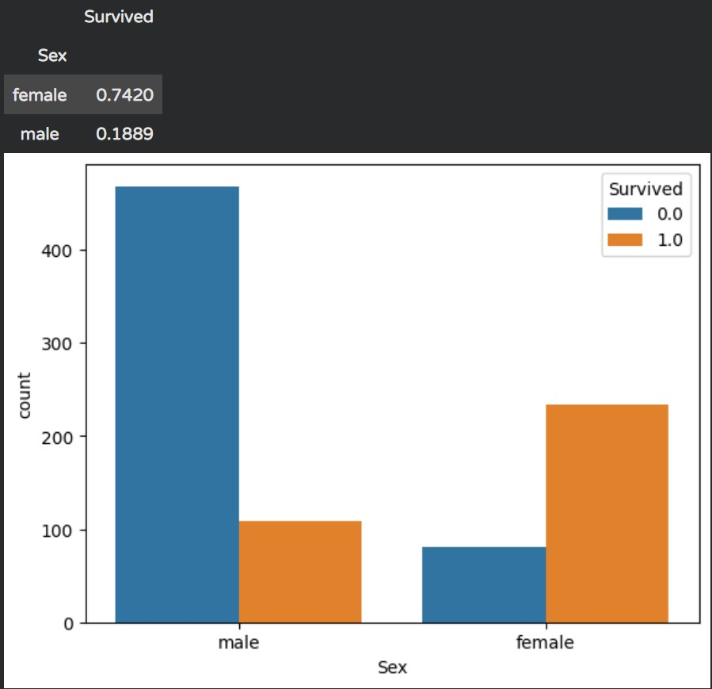
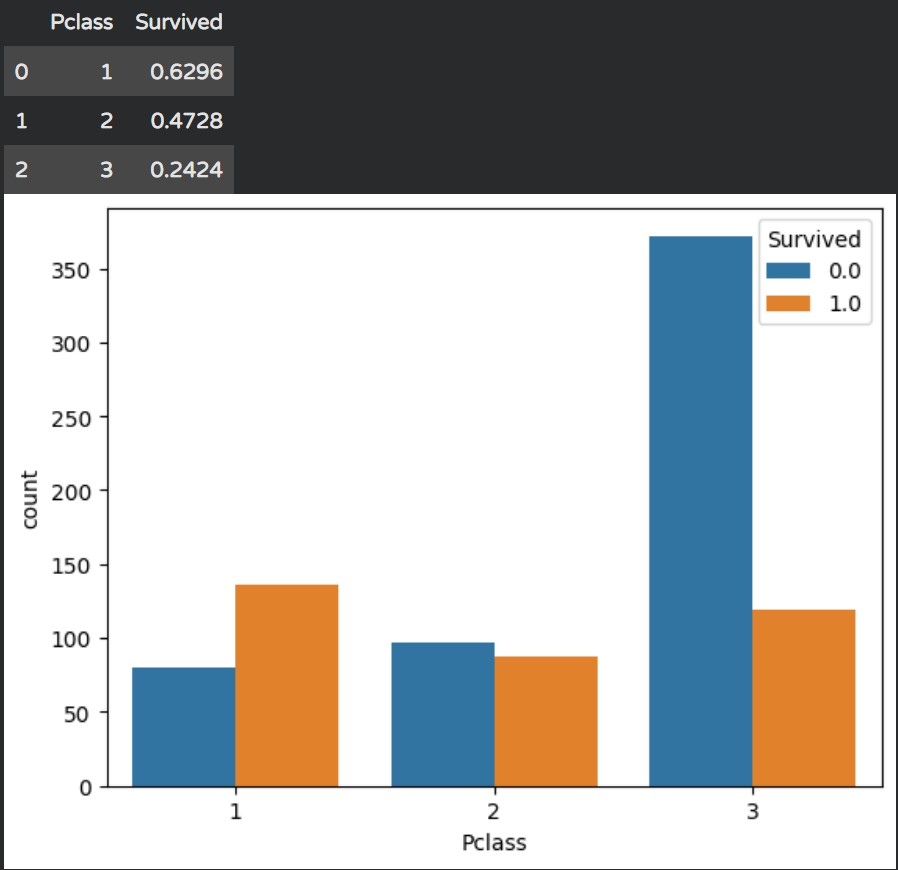

# 🚢 Titanic Survival Prediction using PyTorch

本專案使用 **PyTorch** 建構多層感知機（Multilayer Perceptron, MLP）深度學習模型，針對 Kaggle 經典的 **Titanic: Machine Learning from Disaster** 資料集進行乘客生存預測。

---

## 📌 專案亮點與流程 

1. 資料探索與處理 ：
   - 視覺化分析 `Sex` 與 `Pclass` 對生存率的關鍵影響。
   - 使用類別對應將文字特徵轉為數值標籤（如：`male: 1`, `female: 0`）。
   - 對缺失值（如 `Age` 欄位）進行均值填補。
2. 驗證集劃分 ：
   - 將原始訓練集手動分割出 100 筆獨立的驗證集，用於模型超參數調整，防止模型「死背」數據（Overfitting）。
3. 自訂 PyTorch Dataset & DataLoader：
   - 繼承 `torch.utils.data.Dataset` 封裝訓練、驗證與測試集。
   - 利用 `DataLoader` 進行 Batch 化處理（Batch Size = 100）與資料 Shuffle。
4. 深度學習模型架構：
   - 搭建包含非線性啟動函數（ReLU）的前饋神經網路。
   - 使用 `CrossEntropyLoss` 與 `Adam` 優化器進行 50 個 Epoch 的訓練與驗證。

---

## 📊 資料探索診斷 (Exploratory Data Analysis)

藉由 Seaborn 繪製直方圖並統計平均存活率，資料顯示特徵與生存率有極高的相關性：

### 1. 性別與存活率關係 (`Sex`)
* **女性存活率**：**74.20%**
* **男性存活率**：**18.89%**
* **分析**：女性乘客的存活率顯著高於男性，符合鐵達尼號救援時「婦幼優先」的歷史情境。



---

### 2. 船艙等級與存活率關係 (`Pclass`)
* **頭等艙 (Class 1)**：**62.96%**
* **二等艙 (Class 2)**：**47.28%**
* **三等艙 (Class 3)**：**24.24%**
* **分析**：艙等越高，存活率呈現明顯的遞減趨勢（Class 1 > Class 2 > Class 3），顯示社經地位與船艙位置顯著影響獲救機會。



---

模型架構：

```text
Input Features (3: Sex_Int, Pclass, Age)
       │
       ▼
┌──────────────┐
│ Linear (3, 64)│
└──────┬───────┘
       │
       ▼
┌──────────────┐
│     ReLU     │
└──────┬───────┘
       │
       ▼
┌──────────────┐
│ Linear (64, 2)│
└──────┬───────┘
       │
       ▼
Output Logits (2: Dead [0], Survived [1])
```

## 📈 訓練與驗證結果 

經過 50 次 Epoch 的訓練，模型表現如下：

* **訓練集準確率 (Train Acc)**：提升至 **~80.5%**
* **驗證集準確率 (Val Acc)**：最高達到 **83.0%**（大約在 Epoch 38 時）
* **收斂情況**：`train_loss` 與 `val_loss` 皆穩定下降並維持在 `0.0047~0.0048` 左右，顯示模型學習狀況良好且無顯著過擬合。

```text
Epoch 1:  train_acc = 54.74% | val_acc = 58.00%
Epoch 15: train_acc = 79.65% | val_acc = 73.00%
Epoch 38: train_acc = 80.15% | val_acc = 83.00%  <-- Peak Performance
Epoch 50: train_acc = 79.65% | val_acc = 75.00%
```

## 📝 檔案結構

```text
.
├── train.csv                                 # Kaggle 訓練集
├── test.csv                                  # Kaggle 測試集
├── pytorch_Titanic性別對存活關係.jpg           # 性別分析圖
├── pytorch_Titanic票的等級對存活關係.jpg       # 艙等分析圖
├── main.py                                   # 主要訓練與預測腳本
└── README.md                                 # 專案說明檔案
```
